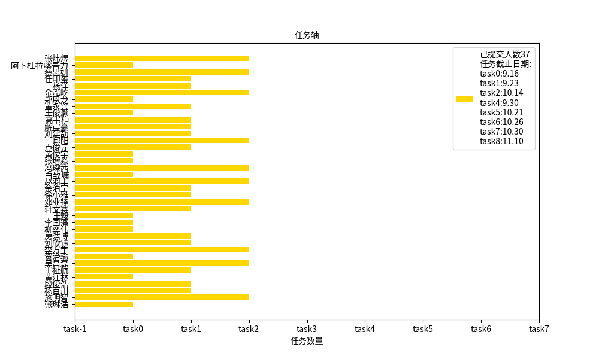

    

<h1 align="center">欢迎报名 IRobot 战队嵌入式组！</h1>

    <a href="http://qm.qq.com/cgi-bin/qm/qr?_wv=1027&k=2JehDBVI8BBWEfourtdRF60RpF1zjHOV&authKey=EvFODrPUWOLijVFji0AScdjeAl2JCO7ZtpbFKF14VjfpjFyHmIU3e%2FijA%2FvoBc2l&noverify=0&group_code=635535591">交流群</a>
    &nbsp;&nbsp;|&nbsp;&nbsp;
    <a href="https://space.bilibili.com/436391821/channel/collectiondetail?sid=1809229">2023培训</a>
      

谢谢你的报名！这里是我们 2025 赛季的招新文档，我们会在这里发布一些公告信息，部分入队考核也会在这里进行。

## 信息发布栏

### 线下课回放/clip+省流教程

- [1.STM32开发环境配置教程](https://www.bilibili.com/video/BV1YosheaEbs)

**嵌入式组 招新 qq 群：** 975049701

**实验室地址：** 南校区大学生活动中心 四楼 407

**联系人：** 不用列出来了哦哦有事在群里公屏打出来就好私聊群主管理也行

## 关于我们

我们是 IRobot 战队嵌入式组，由对嵌入式编程、电子技术和控制理论感兴趣的同学组成。一个赛场上的机器人**需要拥有躯体、可以行动、会感知决策**，嵌入式组的责任就是搭建电路、编写控制程序，让机器人拥有行动能力。

日常工作主要围绕下面这几项技术开展：

- 单片机开发
- 嵌入式 Linux、ROS
- 控制算法、仿真
- 功率电子设计（电容）
- PCB 设计

在每个赛季的备赛过程中，我们会并行进行开发和研发两条线，既利用已经掌握的技术造出本赛季要上场的机器人，也学习探索新技术，不断进步迭代;

不管你选择帮助我们造车，还是做一些研究性的贡献，嵌入式组都会是一个绝佳的实践平台，提供你作为个人难以获得的资源。

## 入队考核

相信大家一定会在我们的团队里发挥才能，也会在这里结识志同道合的朋友！但为了确保你能胜任我们的工作，完成规则测评之后，还有几项考核任务需要完成；

如果觉得自己的知识有漏洞也不用担心，部分任务的文档里会包含一些参考资料，以便大家学习相关的知识点。希望大家发挥自学能力和信息检索能力，独立完成这些任务。如果遇到自己实在解决不了的问题，可以在群里提问交流。

**考核任务时间与内容进行了更新，请及时查看！**

### 任务目录

- [任务零：C 语言基础+Git](tasks/0.prerequisites/README.md)

完成任务零之后，标志着你已经有了开始学习的基础；我们会开设一系列集体线下课，教会你使用我们队内的工作流进行 STM32 开发，**时间和地点在招新群里通知**。

考核进度不受线下课影响，如果有能力，可以先行继续完成下面的任务。下面的任务可以乱序进行。

- [任务一：简单 PCB 绘制](tasks/1.pcb/README.md)

#### 考核1

时间：**_2024年10月1日_**
内容：**_在仓库内提交task0以及task1的文件，即为通过考核1。_**
你应该掌握的：

>**1. C语言基本语法（期末考试要求）。**
>
>**2. 基本PCB绘制，嘉立创eda的使用，白嫖打样。**(PS：如果你对硬件电路很感兴趣可以私聊群主，我们需要做超级电容（功率控制板）的队员)
>
>**3. git、github的基本使用。**

-----

- [任务二：C++/CMake](tasks/2.cpp-buildsystem/README.md)

- ~~任务X：Linux 基本使用/Python/ROS2~~ _没有硬性要求必须现在就完成，但是很建议先学起来，这赛季的新方案技术验证一旦完成，ROS+Linux 的方案会取代 STM32。_

- [任务三：二轴云台](tasks/3.EasyGimbal/README.md)

**接下来的这些任务需要来实验室完成：**

来之前先在[问卷](https://w0ybodqyg7f.feishu.cn/share/base/form/shrcnmOrLiNsDxQ9RQW10x1NaSf)里预约一下你要来的时间，或者在群里问问有没有队员有空，我们会抽人联系你接应一下，防止迷路。

- [任务四：焊接](tasks/4.solder/README.md)

#### 考核2

时间：**_2024年10月31日_**（请尽量提前安排，避免影响期中考试10月29日）
内容：**仓库上传完成task2。制作完成二轴云台、焊接降压板，线下验收。**
你应该掌握的：

>**1. C++语言基本语法、cmake的使用**（请自己寻找资源学习）
>**2. stm32的基本知识，如GPIO输入输出，外部中断，定时器，I2C通讯，串口通讯**（我们会上课，不过也建议自己学习，推荐B站[keysking](https://www.bilibili.com/video/BV12v4y1y7uV/?spm_id_from=333.999.0.0&vd_source=a64b22645c4d668d7e5beef523c00772)的教程）
>**3. 基本焊接技能**（看视频自学后来实验室焊接，也可以找学长指导）

-----

- [任务五：底盘控制 - 驱动 CAN 总线电机/PID 控制器](tasks/5.chassis/README.md)

- [任务六：云台控制 - 姿态解算/PID 控制器](tasks/5.gimbal/README.md)

- [任务七：整车控制](tasks/6.vehicle/README.md)

#### 考核3（最终考核）

时间：**_2024年11月30日_**
内容：**线下完成整车基本运动控制（请多来实验室）**
附：完成考核三即正式加入IRobot嵌入式组。
你应该掌握的：

>**1. can通讯协议以及pid算法，dji电机的控制**
>**2. 陀螺仪的使用，遥控器信息处理，底盘运动解算**
>**3. freertos机器人操作系统的认识**
-----

- 任务八：认识裁判系统 - 真·整车控制

- 任务九：和机械组协作

你应该掌握的：

>**1. 对RoboMaster规则的深入了解（官方规则测评）**
>**2. 对战场上上场车的整体电控认识**
>**3. 与兵种组（主要是机械组）成员合作进行新车的制造**

-----

在完成以上任务之后，你就是一名合格的嵌入式组队员了！进队之后，你就肩负着完成自己负责的任务的责任，尽快和大家熟络起来、尽快对 rm 的比赛规则和比赛生态建立理解、积极完成任务、放开手脚干。

### 考核进度跟踪(**这个现在基本没有参考价值**)

下图显示了你们的进度。信息随时更新，如果你顺利完成了一项任务，那么你的进度条会前进到这一项任务处。***大家按照要求，一个任务用一个文件夹或者一个文件，我是按照你名字文件夹下的目录数量来更新时间轴的***

## 神爹求带

有余力或者有基础的话，一定要尝试一下以下内容！要是你本来就会的话就更好了！

如果你确实对下面这些玩意其中一二驾轻就熟，能胜任这些方面的工作，请务必大胆说出来，你的贡献会对我们有很大帮助 ⬇️⬇️

- 单片机视觉 **【嵌入式】**

  - ESP32-CAM CV

  - OpenMV

  - tflite

- 嵌入式 Linux **【嵌入式】**

  - 内核裁剪

  - 内核模块开发

  - systemd 裁剪

  - 嵌入式瘦客户端

- 深度学习->强化学习 **【控制算法/仿真】**

  - 常用强化学习算法（PPO、DQN...）

  - stable-baseline3, gym 生态

  - Isaac Sim

  - 嵌入式平台模型部署/模型加速

- 软件工程 **【软件/嵌入式】**

  - CI/CD

  - Modern C++

  - 设计模式

- Nav2/MoveIt2/ros2-control 等常用 ROS2 框架 **【控制算法/仿真】**

- 自控原理、最优控制 **【控制算法】**

- 数字信号处理 **【控制算法】**

- 功率电子 **【硬件】**

## 最后：

认真干活虽然重要，也祝你在实验室玩的开心！

