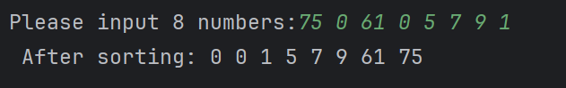

# 任务零：C 语言基础+Git

## 📃 任务描述

在这个任务中，你需要编写一个最基本的 C 语言程序，并且使用 Git 进行简单的版本控制和团队协作。

开始做任务之前，先注册一个 GitHub 账号；

## 🎯 任务目标

使用 C 语言编写一个冒泡排序程序：用户输入几个数字，使用冒泡排序算法将输入的整数从小到大排序并且打印出来。

在这个仓库的[`submission`目录](../../submissions/README.md)下建一个以你的名字命名的文件夹；把程序源代码放进去，并提交一个 Pull Request。

## 🔗 参考资料

- [C 语言教程 | 菜鸟教程](https://www.runoob.com/cprogramming/c-tutorial.html)

- [C 语言期末不挂科 | 补考 | 速成课 | 3 小时拿下期末](https://www.bilibili.com/video/BV1pE421N7en/)

- [【git、github 保姆级教程入门，工作和协作必备技术，github 提交 pr - pull request】](https://www.bilibili.com/video/BV1s3411g7PS/)
