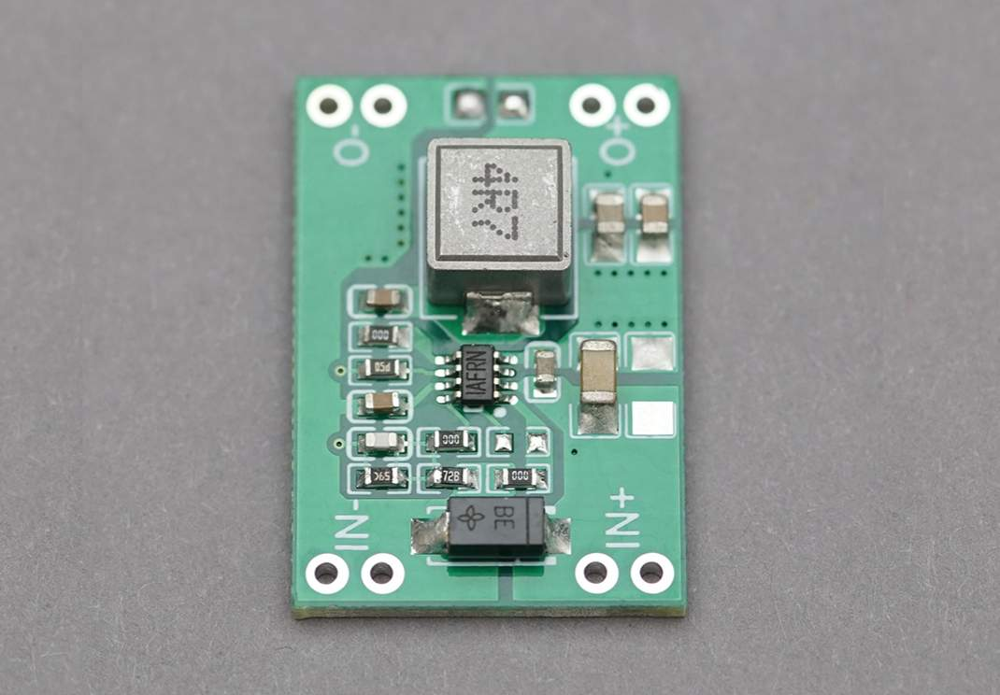

# 任务二：简单 PCB 绘制

## 📃 任务描述

动手画一块降压板！

在机器人上有很多设备，他们需要的供电电压五花八门，19V 给车载 PC 供电、24V 给开发板供电、5V 给红点激光器供电等等；但电源只由一块 24V 的电池来提供。

这时候就需要结合使用 DCDC 电源 和 LDO 电源来把 24V 电压变成我们想要的比较低的各种电压。

## 🎯 任务目标

绘制一块从 24V 到 5V 的 DCDC 降压模块，并且打样把板子生产出来。

板子的外形类似于下图，但不要求完全一样：

## 🔗 参考资料

- [免费 PCB 打样教程 | 嘉立创 EDA 教育与开源文档中心](https://wiki.lceda.cn/zh-hans/design-production/free-pcb.html)

- [【保姆级】二十分钟零基础 PCB 绘制打样一条龙教程（立创 EDA 专业版）](https://www.bilibili.com/video/BV1J24y1Z7cY/?share_source=copy_web&vd_source=705edeb1573287133e920650d6885caf)

- [合集·dcdc 模块设计--降压篇](https://space.bilibili.com/43584648/channel/collectiondetail?sid=106540)

- [P5*AMS1117 理论讲解\_LDO 电路原理*电路设计*PCB 设计\_STM32 入门教程\_0 基础手把手*电容原理\_充放电](https://www.bilibili.com/video/BV1ru4y1U7P6)
