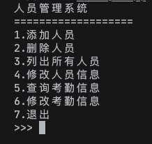

# 任务四：C++/CMake

## 📃 任务描述

用 C++编写一个可操作的战队人员管理系统，使用 CMake 组织项目中的源文件和头文件。

## 🎯 任务目标

提交的成品应该实现的功能：

1. 增删改查队员信息，队员信息包括学号、姓名和入队年月。

2. 增删改查对应队员的考勤信息，考勤信息包括打卡次数、打卡记录和总工作时间。

3. 按照学号、入队年月数据对队员信息进行排序；按照打卡次数、总工作时间对考勤信息进行排序。

4. 用户输入有误导致程序出错时(如未按格式输入、学号冲突、打卡次数与打卡记录不匹配、打卡时间超出范围如 25:61 等)应当报错，不会导致程序崩溃或者逻辑错误。

你应该提交一个完整的工程文件夹，类似下图结构：

提交方法同任务零，把作品放在你的文件夹里，然后提交一个 Pull Request。

## 约束

- 禁止使用指针

- 禁止使用 C 语言数组

- 禁止依赖 Visual Studio 等 IDE 的简化构建系统完成任务，必须使用 CMake 作为构建工具。

## bonus

如果成品表现出了你的亮点，包括且不限于下面几条：

1. 你对面向对象编程有比较深刻的理解

2. 你可以结合利用数据结构、算法和语言知识最大化程序的运行效率

3. 你认识并熟练掌握 C++的一些高级特性，如所有权、模板、异常处理、STL 等

4. 你熟知并且理解 CMake、make、编译器、链接器等等工具链组件各部分的作用

5. 你在写程序时不仅仅考虑把程序写到能跑，还会注意代码的可维护性、可扩展性和编码风格

会考虑优先采用

## 🔗 参考资料

- [C++ 教程 | 菜鸟教程](https://www.runoob.com/cplusplus/cpp-tutorial.html)

- [【C++】6 小时学完 C++|C++面向对象编程|期末突击【慕课】](https://www.bilibili.com/video/BV1ZT4y1C7WR)

- [从零开始详细介绍 CMake](https://www.bilibili.com/video/BV1vR4y1u77h)
