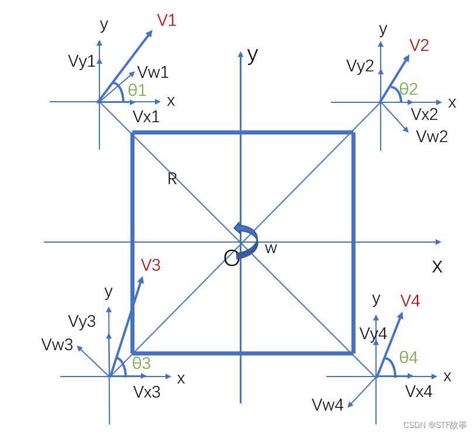

# 任务五：底盘控制 - 驱动 CAN 总线电机/PID 控制器

## 📃 任务描述

驱动一个麦轮，全向轮，或者舵轮底盘

## 🎯 任务目标

1. 驱动 CAN 总线电机、获取电机反馈信息：让一个 3508 云台电机转起来，并且顺利接收它反馈回来的信息，如位置、转速等等

2. 使用 PID 控制器控制电机的位置：类比参考资料里 PID 课程提到的”控制无人机高度“的例子，使用附录里给出的 PID 控制器来控制 3508 电机的位置

3. 完成底盘控制：根据各种底盘的运动学解算，算出每个轮子的速度后使用pid精确控制底盘的运动。



## 🔗 参考资料

- [RoboMaster 开发板 C 型用户手册](https://rm-static.djicdn.com/tem/35228/RoboMaster%20%20开发板%20C%20型用户手册.pdf)

- [通俗易懂的 PID 控制算法讲解](https://www.bilibili.com/video/BV1et4y1i7Gm)

- [RoboMaster/Development-Board-C-Examples](https://github.com/RoboMaster/Development-Board-C-Examples)

## 附录

### PID 控制器实现

```c
typedef struct {
    double kp;  // 比例系数
    double ki;  // 积分系数
    double kd;  // 微分系数
    double previous_error;  // 上一次误差
    double integral;  // 积分累积
    double output;    // 输出
} pid_t;

void PidInit(pid_t *pid, double kp, double ki, double kd) {
    pid->kp = kp;
    pid->ki = ki;
    pid->kd = kd;
    pid->previous_error = 0.0;
    pid->integral = 0.0;
}

void PidUpdate(pid_t *pid, double setpoint, double measured_value, double dt) {
    double error = setpoint - measured_value;
    pid->integral += error * dt;
    double derivative = (error - pid->previous_error) / dt;
    double output = pid->kp * error + pid->ki * pid->integral + pid->kd * derivative;
    pid->previous_error = error;
    pid->output = output;
}
```
