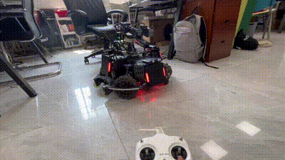

# 任务七：整车控制

## 📃 任务描述

让一辆步兵机器人拥有最基础的行动能力：前后左右移动、转动云台和底盘自转。

## 🎯 任务目标

读取遥控器输入，完成整车运动控制

## 🔗 参考资料

- [RoboMaster/Development-Board-C-Examples](https://github.com/RoboMaster/Development-Board-C-Examples)
